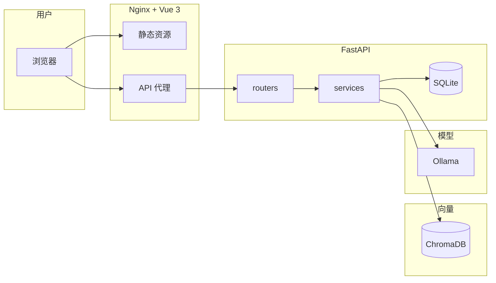

# Knowledge Agent — 开发文档

> 技术栈、配置、API 参考等。项目展示见 [README.md](README.md)

企业 RAG 知识库问答管理系统。支持传统 RAG 和 Agentic RAG 双模式。

已打通完整链路：知识库管理、文档解析切块、向量索引、语义检索、流式问答、多轮对话、引用追溯、质量反馈、Agentic 自主检索（查询分析→检索→评估→改写重试→Web 搜索回退）。前端统一对话界面，仪表盘首页，全局错误提示，RAGAS 对比评测。

## 系统架构



## 技术栈

- Frontend: Vue 3 + TypeScript + Vite + Ant Design Vue
- Backend: FastAPI + SQLite
- Vector DB: Chroma
- Document parsing: Markdown / Text / PDF（pdfplumber 表格提取）/ DOCX
- Embedding: OpenAI-compatible API，推荐本地 Ollama `nomic-embed-text`
- LLM: OpenAI-compatible API，支持流式输出

## 已实现功能

### 知识库管理
- 知识库创建、列表、更新、删除
- 文档上传（魔术字节校验）、列表（搜索/筛选/分页）、删除
- 文档解析：段落感知语义切块，PDF 表格提取（pdfplumber），支持 MD/TXT/PDF/DOCX
- embedding 分批请求，避免超时
- SQLite 持久化任务队列，解析/索引异步执行，服务重启不丢任务

### 检索与问答
- 混合检索：向量 Top-K + BM25 关键词，RRF 融合排序
- Chroma 向量索引与 Top-K 语义检索（分数色条可视化）
- 流式 SSE 问答（逐 token 渲染）
- 统一对话界面：多轮上下文自动传递，气泡 UI，Agentic/标准模式一键切换
- 检索结果默认折叠，回答区左右分栏（左回答 / 右引用来源）
- **来源过滤**：只展示 LLM 实际引用的来源（如 `[1][4]` 只显示 2 个），未采用的不占空间
- 引用双向联动（回答引文 ↔ 来源卡片 hover 高亮 + click 滚动）
- 回答质量反馈（👍/👎 评分持久化）

### Agentic RAG
- **查询分析**：LLM 判断查询复杂度，复杂问题自动拆分为原子性子问题
- **自纠正检索**：LLM 评估检索质量（1-5 分），评分不足时自动改写查询重试，最多 3 轮
- **Web 搜索回退**：知识库检索耗尽后，可选启用 DuckDuckGo 外部搜索补充上下文
- **LangGraph 状态图**：9 节点、4 条路由分支，全程可观测
- **前端切换**：对话输入区一键切换标准/Agentic 模式，实时显示检索轮数和评分
- 两种模式共存，原有 `/questions` 端点完全不受影响
- **RAGAS 评测**：Agentic context_recall 比传统 RAG 提升 10%（0.49→0.59），precision 持平

### 对话管理
- **对话持久化**：`conversations` 表 + CRUD API，Q&A 关联 `conversation_id`，页面刷新不丢对话
- **对话列表**（ChatGPT 风格）：侧栏显示所有对话，第一条问题自动做标题，一键切换/删除
- **历史恢复**：进入知识库自动加载最近对话，多轮上下文完整保留

### 工程质量
- API Token 认证（时序安全比较）
- API 限流（滑动窗口 IP 限流，默认 60 req/min）
- 结构化日志（JSON 格式 + X-Request-ID 全链路追踪）
- Agentic 流程每步实时日志输出
- 全局错误提示：axios 拦截器 + ErrorToast 组件，区分网络/5xx/业务错误
- 服务启动时自动恢复卡住的异步任务
- 健康检查覆盖数据库、ChromaDB、LLM 连通性
- CORS 可配置（`CORS_ORIGINS` 环境变量）
- Docker Compose 一键部署
- CI：GitHub Actions 自动测试 + 类型检查 + 构建
- 后端 74 个单元测试（检索、分词、RRF、问答、任务队列、Agentic 图等）
- 设计决策文档（`docs/decisions.md`）+ 设计规范文档（`DESIGN.md`）
- RAGAS 对比评测结果（传统 vs Agentic）

### 检索增强
- Cross-encoder 重排（可选）：候选 4 倍扩召回，BGE-Reranker 精排取 Top-K
- 支持本地 HuggingFace 模型 / 硅基流动云端 API 两种后端，`CROSS_ENCODER_PROVIDER` 切换

### 性能优化
- BM25 索引 pickle 持久化，重启秒加载，免全量重建
- Embedding 向量 SQLite 缓存，相同文本不重复调 API
- 任务队列 Event 唤醒替代轮询，无任务时零 CPU 消耗
- 前端组件异步懒加载，首屏体积优化

## 项目结构

```text
.
├── .github/workflows/
│   └── ci.yml                 # CI：自动测试 + 类型检查 + 构建
├── backend/
│   ├── app/
│   │   ├── agent/                   # Agentic RAG — LangGraph 状态图
│   │   │   ├── state.py             #   AgenticState 定义
│   │   │   ├── nodes.py             #   9 个节点函数（查询分析/检索/评估/改写/生成）
│   │   │   └── graph.py             #   StateGraph 构建 + 条件路由 + run_agentic_qa()
│   │   ├── routers/
│   │   │   ├── knowledge_bases.py   # 知识库 CRUD
│   │   │   ├── documents.py         # 文档上传/解析/索引 + 任务处理器
│   │   │   ├── qa.py                # 检索 + 问答 + 流式 SSE（传统模式）
│   │   │   ├── agentic_qa.py        # Agentic 问答端点 + SSE 流式
│   │   │   ├── history.py           # 问答历史查询/评分/删除
│   │   │   └── conversations.py     # 对话 CRUD（列表/切换/删除）
│   │   ├── repositories/     # SQLite 数据访问（知识库/文档/切块/问答）
│   │   ├── services/         # 解析、切块、索引、检索、问答、LLM/Embedding、关键词检索
│   │   │   ├── llm_agent.py         #   ToolCallingLLMProvider（基于 openai SDK）
│   │   │   ├── query_analysis.py    #   查询复杂度分析 + 子问题拆解
│   │   │   ├── self_corrective.py   #   上下文评估 + 查询改写
│   │   │   ├── web_search.py        #   DuckDuckGo Web 搜索回退
│   │   │   ├── embedding_cache.py   #   Embedding 向量 SQLite 缓存
│   │   │   └── reranker.py          #   Cross-encoder 重排（本地/云端）
│   │   ├── auth.py           # API token 认证（时序安全比较）
│   │   ├── config.py         # 环境变量配置（含 Agentic 开关）
│   │   ├── rate_limit.py     # 滑动窗口 IP 限流中间件
│   │   ├── database.py       # SQLite 初始化
│   │   ├── dependencies.py   # 依赖注入工厂（keyword_engine / task_queue）
│   │   ├── task_queue.py     # SQLite 持久化任务队列（含重试）
│   │   ├── schemas.py        # Pydantic 请求/响应模型（含 Agentic 类型）
│   │   ├── logging_config.py # 结构化日志（JSON / 文本 + request_id）
│   │   └── main.py           # FastAPI app（CORS、X-Request-ID、上传限制、健康检查、启动恢复）
│   ├── tests/                # 74 个单元测试（检索、分词、RRF、问答、任务队列、Agentic 图等）
│   ├── eval/                 # 检索质量评估 + RAGAS 对比脚本
│   ├── data/                 # 本地数据库、上传文件、Chroma 数据
│   └── requirements.txt
├── frontend/
│   ├── e2e/                   # Playwright e2e 冒烟测试
│   │   └── smoke.spec.ts      #   欢迎页 / 创建KB / 问答 / 文档管理 / 响应式
│   ├── playwright.config.ts   # Playwright 配置（自动启动前后端）
│   ├── src/
│   │   ├── router/index.ts   # vue-router 路由配置（/{kb_id} 问答, /{kb_id}/documents 文档管理）
│   │   ├── views/            # WelcomeView(仪表盘) / KbWorkspaceView(问答) / KbDocumentsView(文档管理)
│   │   ├── App.vue           # 管理台外壳（侧栏 + ErrorToast + router-view）
│   │   ├── components/       # Sidebar / DocumentPanel / DebugPanel / ConversationPanel / HistoryPanel / ErrorToast
│   │   ├── composables/      # useKnowledgeBases / useDocuments / useQA / useConversation(含Agentic)
│   │   ├── utils/            # api / citations / format / retrieval / sse(流解析共用模块)
│   │   ├── types/            # 类型定义
│   │   ├── assets/
│   │   ├── main.ts
│   │   └── style.css
│   └── package.json
├── docs/
│   ├── decisions.md          # 设计决策记录（为什么选 RRF、为什么 SQLite 队列等）
│   └── superpowers/          # 产品设计文档
├── DESIGN.md                 # 设计规范（颜色/字体/组件/布局/动效/响应式等 9 章）
├── docker-compose.yml
└── README.md
```

**代码量：11,301 行**（后端 Python 7,345 + 前端 Vue/TS/CSS 3,956）
```

## 环境准备

需要本机已有：

- Python 3.12+
- Node.js 20+
- Ollama，本地 embedding 推荐使用

安装本地 embedding 模型：

```bash
ollama pull nomic-embed-text
```

可选：如果要用本地大模型回答问题，可以准备一个 chat 模型，例如：

```bash
ollama pull qwen2.5:7b
```

## 配置

在项目根目录创建 `.env`：

```bash
# API 认证（留空则不启用认证）
API_TOKEN=

# 上传文件大小限制（默认 50 MB）
MAX_UPLOAD_BYTES=52428800

DATABASE_URL=sqlite:////home/zyp13/projects/Knowledge AI/backend/data/knowledge_agent.db
STORAGE_DIR=/home/zyp13/projects/Knowledge AI/backend/data/uploads
CHROMA_DIR=/home/zyp13/projects/Knowledge AI/backend/data/chroma

EMBEDDING_BASE_URL=http://127.0.0.1:11434/v1
EMBEDDING_API_KEY=ollama
EMBEDDING_MODEL=nomic-embed-text

LLM_BASE_URL=http://127.0.0.1:11434/v1
LLM_API_KEY=ollama
LLM_MODEL=qwen2.5:7b
```

说明：

- `API_TOKEN` 设置后，所有 `/api/` 请求需要携带 `Authorization: Bearer <token>` 头。留空则不启用认证。
- `CORS_ORIGINS` 控制跨域白名单，默认 `*`（开发用）。生产部署时设为具体域名，逗号分隔。
- `LOG_JSON` 设为 `true` 输出 JSON 行日志（含 `request_id`），方便日志采集系统解析。
- `MAX_UPLOAD_BYTES` 限制单次请求体大小，防止上传超大文件。
- `EMBEDDING_*` 用于文档索引和检索查询向量化。
- `LLM_*` 用于问答生成和 Agentic 流程（查询分析/评估/改写均调用 LLM）；只做上传、解析、索引、检索时可以暂时不填。
- `AGENTIC_ENABLED` 设为 `false` 可完全关闭 Agentic 端点（默认 `true`）。
- `AGENTIC_MAX_RETRIEVAL_ROUNDS` 控制 Agentic 最大检索重试轮数（默认 `3`）。
- `RATE_LIMIT_REQUESTS` 每个 IP 每分钟最大请求数（默认 `60`），设为 `0` 关闭限流。
- `RATE_LIMIT_WINDOW` 限流滑动窗口秒数（默认 `60`）。
- `CROSS_ENCODER_ENABLED` 启用跨编码器重排（默认 `false`），开启后检索候选数自动扩大 4 倍再精筛。
- `CROSS_ENCODER_PROVIDER` 重排后端：`siliconflow`（推荐，云端 API）或 `local`（本地 HuggingFace 模型）。
- `CROSS_ENCODER_MODEL` 重排模型名（默认 `BAAI/bge-reranker-v2-m3`）。
- `SILICONFLOW_API_KEY` 硅基流动 API Key（使用云端重排时必填）。
- `SILICONFLOW_BASE_URL` 硅基流动 API 地址（默认 `https://api.siliconflow.cn/v1`）。
- `.env` 已加入 `.gitignore`，不要提交真实密钥。
- 后端对本地 OpenAI-compatible 请求会禁用系统代理，避免访问 `127.0.0.1:11434` 时被代理转发导致 502。
- 服务启动时会自动将卡在 `running` 状态的文档标记为 `failed`，防止重启导致任务丢失。

## 启动后端

```bash
cd backend
python3 -m venv .venv
source .venv/bin/activate
pip install -r requirements.txt
uvicorn app.main:app --reload --port 8000
```

后端默认地址：

```text
http://127.0.0.1:8000
```

健康检查：

```bash
curl http://127.0.0.1:8000/health
```

## 启动前端

```bash
cd frontend
npm install
npm run dev
```

前端默认地址：

```text
http://localhost:5173
```

Vite 已配置 `/api` 代理到 `http://127.0.0.1:8000`。

## MVP 使用流程

1. 打开前端仪表盘（首页）。
2. 创建知识库 → 自动跳转到对话界面。
3. 点击"管理文档 →"进入文档管理页。
4. 上传 Markdown、TXT、PDF 或 DOCX 文档。
5. 点击解析，生成文本切块。
6. 点击索引，调用 embedding 模型并写入 Chroma。
7. 返回对话界面，输入问题开始提问或对话。
8. 回答中点击 `[1][2]` 查看来源，hover 高亮对应卡片。

## API 概览

```text
# 知识库
GET    /api/knowledge-bases
POST   /api/knowledge-bases
GET    /api/knowledge-bases/{knowledge_base_id}
PATCH  /api/knowledge-bases/{knowledge_base_id}
DELETE /api/knowledge-bases/{knowledge_base_id}

# 文档
GET    /api/knowledge-bases/{knowledge_base_id}/documents                ?limit=&offset=
POST   /api/knowledge-bases/{knowledge_base_id}/documents
DELETE /api/knowledge-bases/{knowledge_base_id}/documents/{document_id}

# 解析 / 索引
POST   /api/knowledge-bases/{knowledge_base_id}/documents/{document_id}/parse
POST   /api/knowledge-bases/{knowledge_base_id}/documents/parse-pending
GET    /api/knowledge-bases/{knowledge_base_id}/documents/{document_id}/chunks
POST   /api/knowledge-bases/{knowledge_base_id}/documents/{document_id}/index
POST   /api/knowledge-bases/{knowledge_base_id}/documents/index-pending
POST   /api/knowledge-bases/{knowledge_base_id}/documents/reindex-all

# 检索 / 问答
POST   /api/knowledge-bases/{knowledge_base_id}/retrieve
POST   /api/knowledge-bases/{knowledge_base_id}/questions
POST   /api/knowledge-bases/{knowledge_base_id}/questions/stream           (SSE)
POST   /api/knowledge-bases/{knowledge_base_id}/questions/agentic          (Agentic 非流式)
POST   /api/knowledge-bases/{knowledge_base_id}/questions/agentic/stream   (Agentic SSE)

# 问答历史 / 反馈
GET    /api/knowledge-bases/{knowledge_base_id}/question-answers          ?limit=&offset=
PATCH  /api/knowledge-bases/{knowledge_base_id}/question-answers/{id}/rating
DELETE /api/knowledge-bases/{knowledge_base_id}/question-answers/{id}
```

## Docker 部署

```bash
# 启动全部服务（Ollama + 后端 + 前端）
docker compose up -d

# 首次启动会自动拉取 embedding 模型 nomic-embed-text
# 查看启动日志
docker compose logs -f

# 打开浏览器
# http://localhost:8080
```

如需使用外部 LLM（如 DeepSeek），在 `.env` 或命令行指定：

```bash
LLM_BASE_URL=https://api.deepseek.com/v1 \
LLM_API_KEY=sk-xxx \
LLM_MODEL=deepseek-chat \
docker compose up -d
```

用 Ollama 运行本地 chat 模型：

```bash
docker compose exec ollama ollama pull qwen2.5:7b
```

## Agentic RAG 使用

Agentic RAG 让 LLM 自主决定检索策略，而非一次性检索后直接生成。

### 两种模式对比

| | 标准 RAG | Agentic RAG |
|---|---|---|
| 检索次数 | 1 次 | 1-3 次（自主决定） |
| 检索失败 | 硬答 | 改写查询重试 |
| 复杂问题 | 当整体搜 | 自动拆子问题分别搜 |
| Web 补充 | 无 | 可选 DuckDuckGo 回退 |
| 速度 | ~2-4s | ~4-15s |
| 端点 | `/questions` | `/questions/agentic` |

### Agentic 流程图

```
用户问题
  → Step 1: 查询分析（简单/复杂？复杂则拆子问题）
  → Step 2: 混合检索（向量+BM25+RRF）
  → Step 3: 评估检索质量（1-5 分）
      ├── ≥3 分 → Step 5: 生成答案
      ├── <3 分 + 有剩余轮数 → Step 4: LLM 改写查询 → 回到 Step 2
      ├── <3 分 + 轮数用完 + Web 搜索 → 外部搜索 → Step 5
      └── <3 分 + 轮数用完 → 兜底生成
```

### 通过 API 调用

```bash
# Agentic 非流式
curl -X POST http://127.0.0.1:8000/api/knowledge-bases/{kb_id}/questions/agentic \
  -H "Content-Type: application/json" \
  -d '{"question":"系统支持哪些文件格式？","max_retrieval_rounds":3}'

# Agentic 流式 SSE
curl -N -X POST http://127.0.0.1:8000/api/knowledge-bases/{kb_id}/questions/agentic/stream \
  -H "Content-Type: application/json" \
  -d '{"question":"TCP和UDP有什么区别？","max_retrieval_rounds":3}'

# 启用 Web 搜索回退
curl -X POST .../questions/agentic \
  -d '{"question":"Python的GIL是什么？","max_retrieval_rounds":3,"enable_web_search":true}'
```

### 前端切换

打开前端管理台 → 进入知识库 → 对话输入区上方工具栏点击 **Agentic/标准** 开关。

Agentic 模式下会显示：
- 实时状态：`⚡ 正在分析查询...` → `2 轮检索 · 评分 4/5`
- 子查询拆解详情（复杂查询时）
- 可选启用 Web 搜索回退复选框

### 配置

```bash
# .env 新增字段
AGENTIC_ENABLED=true              # 是否启用 Agentic 端点（默认 true）
AGENTIC_MAX_RETRIEVAL_ROUNDS=3    # 最大检索重试轮数（默认 3）
AGENTIC_WEB_SEARCH_PROVIDER=duckduckgo  # Web 搜索提供商（默认 duckduckgo）
```

关闭 Agentic 模式：`AGENTIC_ENABLED=false`，后端启动时跳过 Agentic 路由注册，原有功能不受影响。

### 终端查看执行流程

后端启动时，Agentic 每步都会在终端输出实时日志：

```
========== Agentic RAG 开始 ==========
问题: TCP和UDP有什么区别？
  Step 1/5: 分析查询...
    → 复杂查询，拆为 2 个子问题: ['What is TCP?', 'What is UDP?']
  Step 2/5: 第 1 轮检索 query='What is TCP?'...
    -> 召回 5 个片段
  Step 3/5: 评估检索质量...
    -> 评分 4/5: Context clearly explains TCP...
  Step 5/5: 生成答案 (共 5 个上下文片段)...
========== Agentic RAG 结束 ==========
结果: 1 轮检索, 评分 4/5, 5 个来源
```

## 检索质量评估

### RAGAS 对比评估

脚本位置：`backend/eval/ragas_eval.py`。自动读取项目 `.env` 配置的 LLM 作为 judge。

对比传统 RAG 和 Agentic RAG 在 faithfulness、context_precision、context_recall 上的表现。

**评测结果（5 条 QA，DeepSeek as judge）：**

| Metric | Traditional | Agentic | Δ |
|--------|------------|---------|---|
| context_precision | 0.7000 | 0.7000 | — |
| context_recall | 0.4905 | **0.5905** | **+10%** |
| faithfulness | 0.9333 | 0.9000 | -3% |

结论：Agentic RAG 在不损失精确度的前提下，召回率提升 10%。

```bash
# 1. 生成评估数据集（从 QA 历史提取）
cd backend && .venv/bin/python eval/generate_eval_dataset.py

# 2. 跑对比评测（依赖 ragas、datasets、langchain-openai）
.venv/bin/python eval/ragas_eval.py
```

## CI

每次 push 自动运行（`.github/workflows/ci.yml`）：

| Job | 内容 |
|-----|------|
| backend | Python 3.12 + pip install + 74 个单元测试 |
| frontend | Node 20 + npm ci + vue-tsc 类型检查 + vite build |
| e2e | Playwright Chromium 冒烟测试（创建知识库 → 问答页 → 文档管理 → 响应式） |

## 测试

**后端 74 个单元测试：**

```bash
cd backend && .venv/bin/python -m unittest discover tests
```

覆盖：知识库 CRUD、文档上传/解析/索引、向量检索、BM25 分词与搜索、RRF 融合排序、问答生成、任务队列、Agentic 状态图（查询分析/检索/评估/改写/去重/生成）、Web 搜索、API 端点。

**前端 e2e 冒烟测试（Playwright）：**

```bash
cd frontend
npx playwright test
```

覆盖：欢迎页加载、创建知识库、问答面板默认 tab、对话记录切换、文档管理页导航、移动端侧栏交互。

**前端构建：**

```bash
cd frontend
npm run build
```

## 常见问题

### 上传后索引报 `Embedding provider is not configured`

检查 `.env` 中是否设置：

```bash
EMBEDDING_BASE_URL=http://127.0.0.1:11434/v1
EMBEDDING_API_KEY=ollama
EMBEDDING_MODEL=nomic-embed-text
```

修改 `.env` 后重启后端。

### 索引报 `model "nomic-embed-text" not found`

本地 Ollama 还没有下载 embedding 模型：

```bash
ollama pull nomic-embed-text
```

### 索引报 `Embedding request failed: 502`

通常是本地模型请求被系统代理影响。当前代码已经对 embedding 和 LLM 请求显式禁用代理；如果仍出现，确认后端已重启并加载最新代码。

### 问答报 `LLM provider is not configured`

索引和检索只需要 embedding；问答还需要配置 `LLM_BASE_URL`、`LLM_API_KEY`、`LLM_MODEL`。

本地 Ollama 示例：

```bash
LLM_BASE_URL=http://127.0.0.1:11434/v1
LLM_API_KEY=ollama
LLM_MODEL=qwen2.5:7b
```

## 下一步

**近期：**
- ~~多轮对话持久化（`conversation_id` 关联多轮 Q&A）~~ ✅
- ~~侧栏知识库列表显示文档数量~~ ✅ 仪表盘
- ~~Embedding 模型本地缓存，避免重复请求~~ ✅ SQLite 缓存
- 移动端响应式适配（DESIGN.md 已定义断点，CSS 部分实现）

**中期：**
- 混合检索结果重排（cross-encoder reranker）
- 用户、角色、知识库级权限

**远期（生产化）：**
- 生产环境：PostgreSQL、S3/MinIO 对象存储
- 监控告警、自动扩缩容
