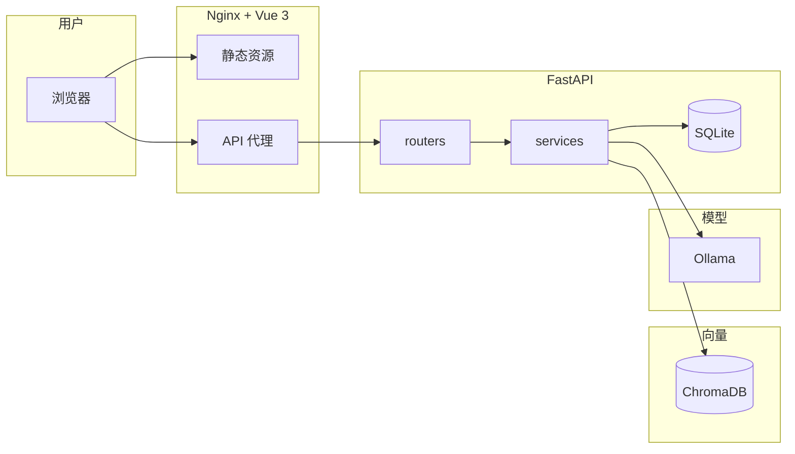

# Knowledge Agent

企业 RAG 知识库问答管理系统。

已打通完整链路：知识库管理、文档解析切块、向量索引、语义检索、流式问答、多轮对话、引用追溯、质量反馈。

## 系统架构



## 技术栈

- Frontend: Vue 3 + TypeScript + Vite + Ant Design Vue
- Backend: FastAPI + SQLite
- Vector DB: Chroma
- Document parsing: Markdown / Text / PDF / DOCX
- Embedding: OpenAI-compatible API，推荐本地 Ollama `nomic-embed-text`
- LLM: OpenAI-compatible API，支持流式输出

## 已实现功能

- 知识库创建、列表、更新、删除
- 文档上传（大小限制）、列表（搜索/筛选/分页）、删除
- 文档解析（段落感知语义切块）与向量索引
- embedding 分批请求，避免超时
- Chroma 向量索引与 Top-K 语义检索（分数色条可视化）
- 流式 SSE 问答（逐 token 渲染）
- 多轮对话（上下文历史传递、气泡 UI）
- 引用双向联动（回答引文 ↔ 来源卡片相互定位）
- 检索结果引用对比（已引用/未采用标记）
- 回答质量反馈（👍/👎 评分持久化）
- API Token 认证
- 服务启动时自动恢复卡住的异步任务
- CORS、健康检查（DB + Chroma）
- 前端 MVP 管理台
- `.env` 配置加载
- 后端单元测试覆盖核心链路
- 统一日志系统

## 项目结构

```text
.
├── backend/
│   ├── app/
│   │   ├── routers/          # FastAPI API 路由
│   │   ├── repositories/     # SQLite 数据访问
│   │   ├── services/         # 解析、切块、索引、检索、问答、LLM/Embedding
│   │   ├── auth.py           # API token 认证
│   │   ├── config.py         # 环境变量配置
│   │   ├── database.py       # SQLite 初始化
│   │   ├── logging_config.py # 日志配置
│   │   └── main.py           # FastAPI app（CORS、上传限制、健康检查、启动恢复）
│   ├── tests/                # 后端测试
│   ├── data/                 # 本地数据库、上传文件、Chroma 数据
│   └── requirements.txt
├── frontend/
│   ├── src/
│   │   ├── App.vue           # 管理台（调试面板 + 对话 + 历史）
│   │   ├── main.ts
│   │   └── style.css
│   └── package.json
└── README.md
```

## 环境准备

需要本机已有：

- Python 3.12+
- Node.js 20+
- Ollama，本地 embedding 推荐使用

安装本地 embedding 模型：

```bash
ollama pull nomic-embed-text
```

可选：如果要用本地大模型回答问题，可以准备一个 chat 模型，例如：

```bash
ollama pull qwen2.5:7b
```

## 配置

在项目根目录创建 `.env`：

```bash
# API 认证（留空则不启用认证）
API_TOKEN=

# 上传文件大小限制（默认 50 MB）
MAX_UPLOAD_BYTES=52428800

DATABASE_URL=sqlite:////home/zyp13/projects/Knowledge AI/backend/data/knowledge_agent.db
STORAGE_DIR=/home/zyp13/projects/Knowledge AI/backend/data/uploads
CHROMA_DIR=/home/zyp13/projects/Knowledge AI/backend/data/chroma

EMBEDDING_BASE_URL=http://127.0.0.1:11434/v1
EMBEDDING_API_KEY=ollama
EMBEDDING_MODEL=nomic-embed-text

LLM_BASE_URL=http://127.0.0.1:11434/v1
LLM_API_KEY=ollama
LLM_MODEL=qwen2.5:7b
```

说明：

- `API_TOKEN` 设置后，所有 `/api/` 请求需要携带 `Authorization: Bearer <token>` 头。留空则不启用认证。
- `MAX_UPLOAD_BYTES` 限制单次请求体大小，防止上传超大文件。
- `EMBEDDING_*` 用于文档索引和检索查询向量化。
- `LLM_*` 用于最终问答生成；只做上传、解析、索引、检索时可以暂时不填。
- `.env` 已加入 `.gitignore`，不要提交真实密钥。
- 后端对本地 OpenAI-compatible 请求会禁用系统代理，避免访问 `127.0.0.1:11434` 时被代理转发导致 502。
- 服务启动时会自动将卡在 `running` 状态的文档标记为 `failed`，防止重启导致任务丢失。

## 启动后端

```bash
cd backend
python3 -m venv .venv
source .venv/bin/activate
pip install -r requirements.txt
uvicorn main:app --reload
```

后端默认地址：

```text
http://127.0.0.1:8000
```

健康检查：

```bash
curl http://127.0.0.1:8000/health
```

## 启动前端

```bash
cd frontend
npm install
npm run dev
```

前端默认地址：

```text
http://localhost:5173
```

Vite 已配置 `/api` 代理到 `http://127.0.0.1:8000`。

## MVP 使用流程

1. 打开前端管理台。
2. 创建一个知识库。
3. 上传 Markdown、TXT 或 PDF 文档。
4. 点击解析，生成文本切块。
5. 点击索引，调用 embedding 模型并写入 Chroma。
6. 输入问题进行检索或问答。
7. 在回答下方查看引用来源。

## API 概览

```text
# 知识库
GET    /api/knowledge-bases
POST   /api/knowledge-bases
GET    /api/knowledge-bases/{knowledge_base_id}
PATCH  /api/knowledge-bases/{knowledge_base_id}
DELETE /api/knowledge-bases/{knowledge_base_id}

# 文档
GET    /api/knowledge-bases/{knowledge_base_id}/documents                ?limit=&offset=
POST   /api/knowledge-bases/{knowledge_base_id}/documents
DELETE /api/knowledge-bases/{knowledge_base_id}/documents/{document_id}

# 解析 / 索引
POST   /api/knowledge-bases/{knowledge_base_id}/documents/{document_id}/parse
POST   /api/knowledge-bases/{knowledge_base_id}/documents/parse-pending
GET    /api/knowledge-bases/{knowledge_base_id}/documents/{document_id}/chunks
POST   /api/knowledge-bases/{knowledge_base_id}/documents/{document_id}/index
POST   /api/knowledge-bases/{knowledge_base_id}/documents/index-pending
POST   /api/knowledge-bases/{knowledge_base_id}/documents/reindex-all

# 检索 / 问答
POST   /api/knowledge-bases/{knowledge_base_id}/retrieve
POST   /api/knowledge-bases/{knowledge_base_id}/questions
POST   /api/knowledge-bases/{knowledge_base_id}/questions/stream          (SSE)

# 问答历史 / 反馈
GET    /api/knowledge-bases/{knowledge_base_id}/question-answers          ?limit=&offset=
PATCH  /api/knowledge-bases/{knowledge_base_id}/question-answers/{id}/rating
DELETE /api/knowledge-bases/{knowledge_base_id}/question-answers/{id}
```

## Docker 部署

```bash
# 启动全部服务（Ollama + 后端 + 前端）
docker compose up -d

# 首次启动会自动拉取 embedding 模型 nomic-embed-text
# 查看启动日志
docker compose logs -f

# 打开浏览器
# http://localhost:8080
```

如需使用外部 LLM（如 DeepSeek），在 `.env` 或命令行指定：

```bash
LLM_BASE_URL=https://api.deepseek.com/v1 \
LLM_API_KEY=sk-xxx \
LLM_MODEL=deepseek-chat \
docker compose up -d
```

用 Ollama 运行本地 chat 模型：

```bash
docker compose exec ollama ollama pull qwen2.5:7b
```

## 测试

后端测试：

```bash
PYTHONPATH=backend backend/.venv/bin/python -m unittest discover backend/tests
```

前端构建：

```bash
cd frontend
npm run build
```

## 常见问题

### 上传后索引报 `Embedding provider is not configured`

检查 `.env` 中是否设置：

```bash
EMBEDDING_BASE_URL=http://127.0.0.1:11434/v1
EMBEDDING_API_KEY=ollama
EMBEDDING_MODEL=nomic-embed-text
```

修改 `.env` 后重启后端。

### 索引报 `model "nomic-embed-text" not found`

本地 Ollama 还没有下载 embedding 模型：

```bash
ollama pull nomic-embed-text
```

### 索引报 `Embedding request failed: 502`

通常是本地模型请求被系统代理影响。当前代码已经对 embedding 和 LLM 请求显式禁用代理；如果仍出现，确认后端已重启并加载最新代码。

### 问答报 `LLM provider is not configured`

索引和检索只需要 embedding；问答还需要配置 `LLM_BASE_URL`、`LLM_API_KEY`、`LLM_MODEL`。

本地 Ollama 示例：

```bash
LLM_BASE_URL=http://127.0.0.1:11434/v1
LLM_API_KEY=ollama
LLM_MODEL=qwen2.5:7b
```

## 下一步

- 后端任务队列化（Celery/arq），避免 BackgroundTasks 重启丢失
- 文档解析增强：旧 `.doc`、PPTX、HTML、PDF 表格提取
- 用户、角色、知识库级权限
- Embedding 模型本地缓存，避免重复请求
- 生产环境：PostgreSQL、S3/MinIO 对象存储、Docker 部署
