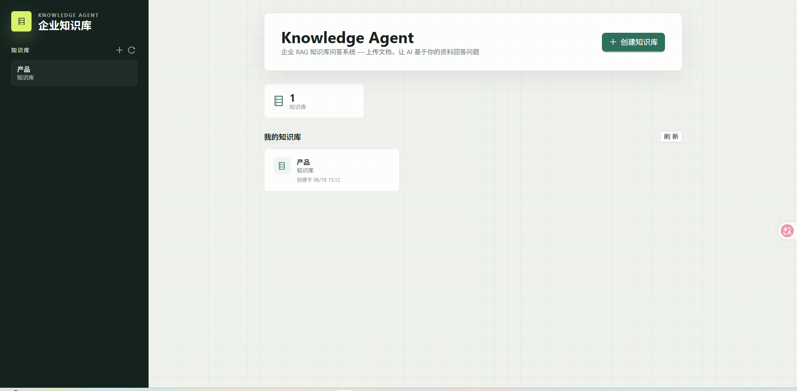
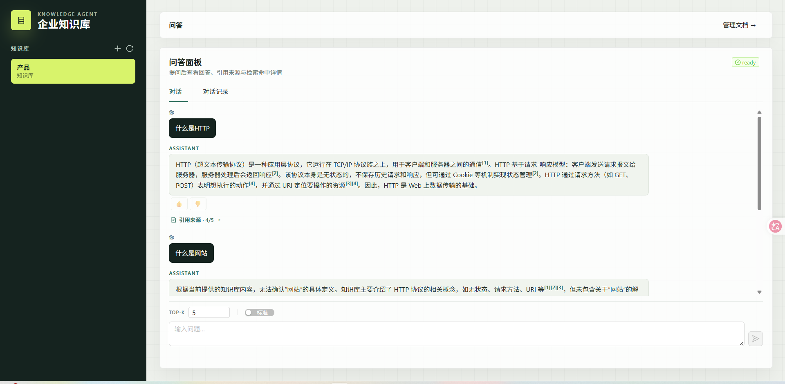
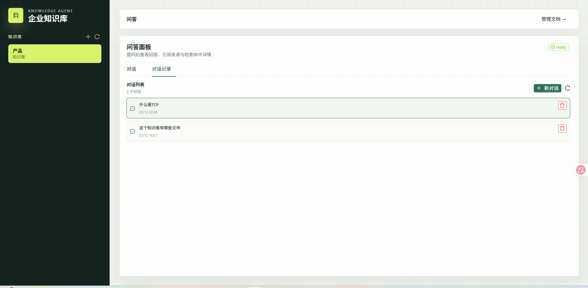
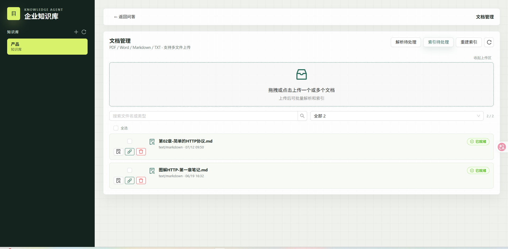
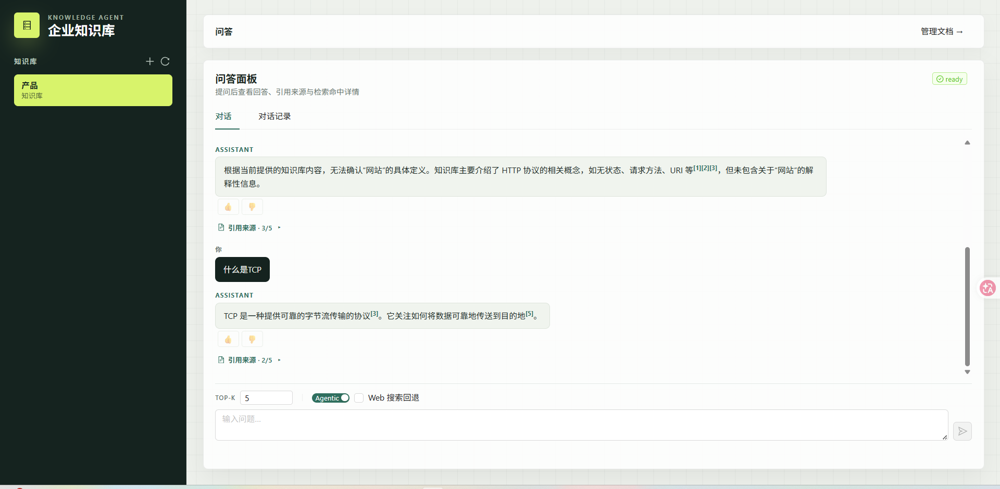

# Knowledge Agent — 项目展示

> 企业 RAG 知识库问答系统 · Vue 3 + FastAPI + LangGraph  
> 支持传统 RAG 与 Agentic 自主检索双模式，完整链路可部署

---

## 项目概览

Knowledge Agent 是一个面向企业的智能知识库问答平台。上传文档 → 自动解析索引 → 自然语言提问 → AI 从知识库中检索并回答，支持引用追溯和质量反馈。

**代码量** ~11,300 行 · **测试** 74 单元 + 6 e2e · **技术栈** Vue 3 / FastAPI / ChromaDB / Ollama

---

## 功能亮点

### 知识库管理
- 创建/编辑/删除知识库，侧栏搜索筛选
- 支持 MD、TXT、PDF（表格提取）、DOCX 四种文档格式
- 段落感知语义切块，异步解析索引，服务重启不丢任务

### 混合检索 + 流式问答
- 向量语义检索 + BM25 关键词检索，RRF 融合排序
- SSE 流式逐 token 输出，多轮对话上下文自动传递
- 引用双向联动：点击 `[1]` → 右侧来源卡片高亮
- 来源过滤：只展示 LLM 实际引用的片段

### Agentic RAG（自主检索）
- LLM 分析查询复杂度，复杂问题自动拆子问题
- 检索质量评估（1-5 分），不足时改写查询重试（最多 3 轮）
- DuckDuckGo Web 搜索回退
- LangGraph 9 节点状态图，全程可观测
- RAGAS 评测：context_recall 比传统模式提升 10%

### 对话管理
- ChatGPT 风格对话列表，多轮对话持久化
- 新建/切换/删除对话，刷新页面自动恢复
- 回答质量反馈（👍👎）

### 工程质量
- API Token 认证 + IP 限流
- BM25 索引持久化 + Embedding 缓存
- 结构化日志 + X-Request-ID 全链路追踪
- 健康检查覆盖数据库 / ChromaDB / LLM
- CI：74 单元测试 + 6 e2e 冒烟测试 + 类型检查
- Docker Compose 一键部署
---

## 系统截图

### 仪表盘首页


### 对话问答


### 对话列表


### 文档管理


### Agentic 检索流程


---

## 系统架构

```
浏览器 (Vue 3 + Ant Design)
    │
    ├─ Nginx / Vite proxy
    │
    ▼
FastAPI 后端
    ├─ SQLite（知识库 / 文档 / 对话 / 任务队列）
    ├─ ChromaDB（向量存储 + HNSW 检索）
    └─ Ollama / OpenAI API（LLM + Embedding）
```

---

## RAGAS 评测数据

| 指标 | 传统 RAG | Agentic RAG | 变化 |
|------|---------|------------|------|
| context_precision | 0.70 | 0.70 | — |
| context_recall | 0.49 | **0.59** | **+10%** |
| faithfulness | 0.93 | 0.90 | -3% |

Agentic 模式在不损失精确度的前提下，召回率提升 10%。

---

## 快速开始

```bash
# 1. 启动全部服务
docker compose up -d

# 2. 打开浏览器
# http://localhost:8080

# 3. 本地开发
cd backend && uvicorn app.main:app --reload --port 8000
cd frontend && npm run dev
```

详见 [README.md](README.md)
